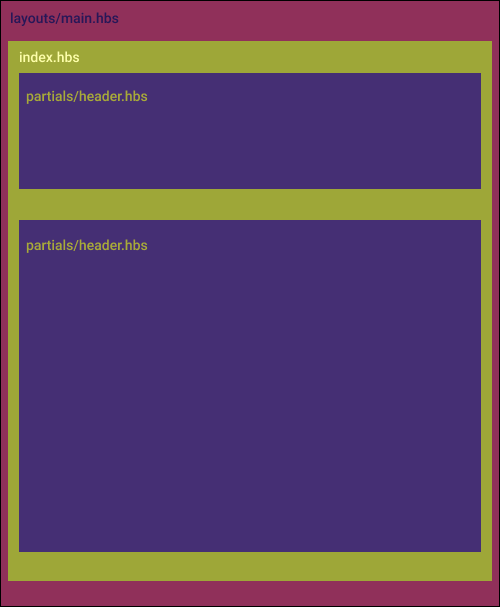

# Handbars view engine
Handlebars is a templating script to generate HTML. 

### Main tags
| tags | description |
| ------ | ------ |
| **{{ }}** | Display variables(HTML Escaped) |
| **{{{ }}}** | Unescaped output to page (Raw Html) |
| **{{# }}** **{{/ }}** | Evaluate context (Logic) |
| **{{! }}** | Comment tag, no execution, no output |
| **{{>header}}** | Embed html from another file in **partials** directory (header.hbs) |

### Embed other HTML files
```sh
  {{>header}}
```

### If / Else statement and Iterate through an array
```sh
  {{#if this.comments}}
    <ul class="list-group">
      {{#each this.comments}}
      <li class="list-group-item">{{quickComment this}}</li>
      {{/each}}
    </ul>
    {{else}}
    <ul class="list-group">
      <li class="list-group-item">Be first to comment on this post!</li>
    </ul>
  {{/if}}         
```

<p align="center">
  
</p
